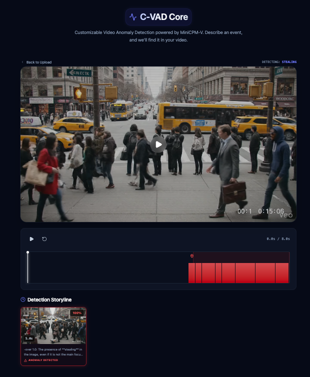
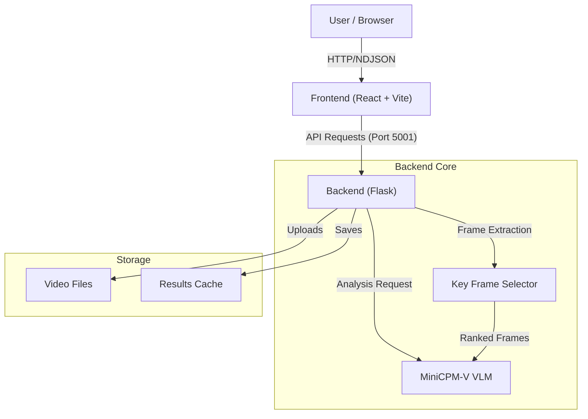

# AnyAnomaly

**AnyAnomaly** is an interactive, natural-language-driven Video Anomaly Detection (VAD) system. It leverages state-of-the-art Large Vision-Language Models (specifically [MiniCPM-V 2.6](https://huggingface.co/openbmb/MiniCPM-V-2_6)) to allow users to search for specific actions or anomalies in videos (e.g., "fighting", "running", "truck") simply by typing a prompt.

The system provides a visual timeline of events, Key Frame Selection (KFS), and explainable scoring, making complex video analysis accessible and intuitive.



## ✨ Features

- **Natural Language Detection**: Detect arbitrary anomalies using open-ended text prompts.
    - **Supported Categories** (Standard): `fighting`, `running`, `throwing`, `falling`, `loitering`, `jumping`, `skateboarding`, `too_close`.
    - **Objects**: `car`, `bicycle`, `motorcycle`, `hand_truck`.
    - *Note: You are not limited to this list. The system uses a VLM and can detect almost any visual concept.*
- **Multimodal Understanding**: built on MiniCPM-V 2.6 for strong OCR and action recognition.
- **Visual Storyline**: Extracts and displays keyframes relevant to your query.
- **Precise Timeline**: Interactive graph showing anomaly scores over time.
- **YouTube Support**: Analyze videos directly from YouTube URLs.
- **Edge Optimized**: Configurable for running on consumer hardware (Mac M-series, consumer GPUs) via int4 quantization.

## 🏗️ Architecture



## 🛠️ Tech Stack

- **Backend**: Python, Flask, PyTorch, Transformers, CLIP, OpenCV.
- **Frontend**: React, Vite, Tailwind CSS v4, Recharts.
- **AI Core**: MiniCPM-V 2.6 (AutoGPTQ/BitsAndBytes support planned).

## 🚀 Prerequisites

- **Python 3.10+**
- **Node.js 18+**
- **uv** (recommended for Python package management)
- **Hugging Face Account**: You need an Access Token with permission to access gated models (like MiniCPM-V).
- **FFmpeg**: Required for video processing (usually installed via system package manager).

## 📦 Installation

### 1. Clone the Repository
```bash
git clone https://github.com/yourusername/AnyAnomaly.git
cd AnyAnomaly
```

### 2. Backend Setup
We use `uv` for fast and reliable package management.

```bash
cd backend

# Create virtual environment
uv venv

# Activate virtual environment
source .venv/bin/activate

# Install dependencies
uv pip install -r requirements.txt
```

> **Note**: If you are on an Apple Silicon Mac, ensure you are using a Python version compatible with MPS (Metal Performance Shaders) for GPU acceleration.

### 3. Frontend Setup

```bash
cd ../frontend

# Install dependencies
npm install
```

## 🏃‍♂️ Usage


### Start the Backend (Linux/Mac)
The backend runs on port `5001`.

```bash
# In backend/ directory
source .venv/bin/activate
export HF_TOKEN="your_hugging_face_token"
export MODEL_PRECISION="bf16" # or "int4"
python app.py
```

*The first run will download the MiniCPM-V model (~15.5GB for BF16, ~8GB for INT4). Ensure you have a stable internet connection.*

**Expected Output:**
When the backend starts successfully, you should see logs similar to this (timestamps will vary):
```text
2026-01-26 11:04:27,098 - INFO - Initializing C-VAD Detector (this may take a while)...
2026-01-26 11:04:27,098 - INFO - Configuration: DEVICE=auto, QUANTIZE=False, FRAME_INTERVAL=1
2026-01-26 11:04:27,151 - INFO - Using device: mps
2026-01-26 11:04:27,151 - INFO - Loading LVLM: MiniCPM-V-2_6...
2026-01-26 11:04:27,151 - INFO - Configuration: Using BF16 model on mps.
2026-01-26 11:04:27,151 - INFO - Loading model from openbmb/MiniCPM-V-2_6 with trust_remote_code=True on mps
`torch_dtype` is deprecated! Use `dtype` instead!
2026-01-26 11:04:27,753 - INFO - vision_config is None, using default vision config
Loading checkpoint shards:   0%|                                                     | 0/4 [00:08<?, ?it/s]
```

### Start the Frontend
The frontend runs on `http://localhost:5173`.

```bash
# In frontend/ directory
npm run dev
```

### Analyze a Video
1. Open `http://localhost:5173` in your browser.
2. Upload a local video file OR paste a YouTube URL.
3. Enter a text prompt (e.g., "person falling", "fire", "car crash").
4. Click **Analyze**.
5. View the score timeline and extracted keyframes.

### CLI Mode (Console)
You can run the anomaly detection directly from the command line without the web interface.

```bash
# Basic usage
python backend/cli.py input_video.mp4 --keywords "fighting,running"

# With INT4 quantization (for Mac with <16GB RAM)
python backend/cli.py input_video.mp4 --keywords "fighting,running" --quantize

# Save details to JSON
python backend/cli.py input_video.mp4 --keywords "fire" --output json --save-results

# Video Summarization
python backend/cli.py input_video.mp4 --mode summarize --save-results
```

**Arguments:**
- `video_path`: Path to the input video file.
- `--mode`: `detect` (default) or `summarize`.
- `--keywords`: Comma-separated list of anomalies (Required for `detect` mode).
- `--quantize`: Enable 4-bit quantization (recommended for MPS/Mac).
- `--output`: Output format, `text` (default) or `json`.
- `--save-results`: Save the analysis results to a JSON file.


## 🔧 Configuration

You can customize the backend behavior via environment variables:

- **`MODEL_PRECISION`**: Controls the model loading precision.
    - `bf16` (Default): Uses full-precision (BFloat16) model. Requires ~16GB VRAM/RAM.
    - `int4`: Uses 4-bit quantized model. Faster, requires ~8GB VRAM/RAM.
- **`INFERENCE_DEVICE`**: Manually set the inference device.
    - `auto` (Default): Automatically detects CUDA > MPS > CPU.
    - `cuda`, `mps`, `cpu`: Force usage of a specific device.
- **`HF_HOME`**: Directory to store Hugging Face model cache (e.g., `D:\huggingface`).
- **`UV_CACHE_DIR`**: Directory for `uv` package cache.
- **`FRAME_INTERVAL`**: (Upcoming) Process every Nth frame to speed up analysis.

## 🧪 Experimental Optimizations (Status: On Hold)

We recently attempted to integrate several performance optimizations ("Bolt" series) to improve inference speed on consumer hardware. These are currently **on hold** due to compatibility issues with the MPS (Mac) backend.

### Attempted Features
- **PR #12: Optimize CLIP Preprocessing**: Attempted to streamline image preprocessing for the CLIP encoder.
- **PR #18: Optimize Grid Pattern**: Proposed a more efficient grid slicing strategy for high-res image analysis.
- **PR #19: Pre-compute CLIP**: Tried to cache/pre-compute CLIP embeddings to reduce redundant computation.

### Known Issues
All three experimental branches encountered a critical `RuntimeError: Cannot copy out of meta tensor; no data!` when running on Apple Silicon (MPS). This indicates a regression in tensor device placement or compatibility with the current `MiniCPM-V-2_6` implementation on this architecture.

**Current Recommendation**: Use the stable `main` branch. Do not merge these experimental PRs until the tensor offloading issues are resolved.

## ⚠️ Troubleshooting


## 📜 License

MIT License. See `LICENSE` for details.
