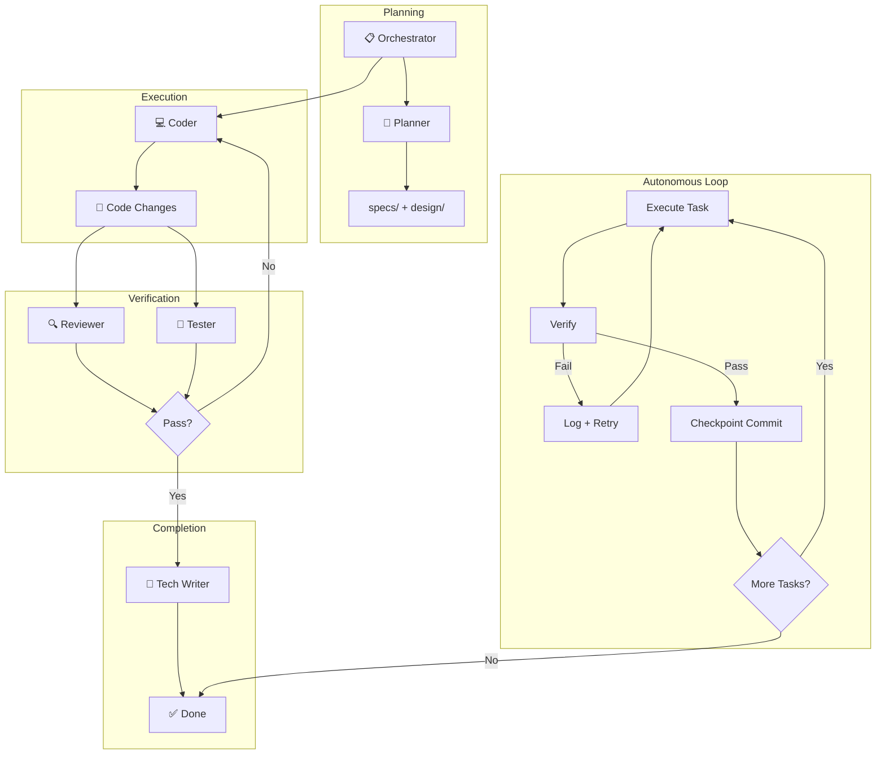

# AI Agent Framework

A modular, token-optimized agent architecture for AI-assisted software development.

## Features
- **Orchestrator Pattern**: Orchestrator delegates to specialized subagents
- **Shared State**: Central `SCRATCHPAD.md` for multi-agent coordination
- **Autonomous Iteration**: Ralph Wiggum technique for "ship code while you sleep"
- **Multi-Platform**: Supports Gemini/Antigravity and Claude Code
- **Token Optimized**: Concise index files save context window

## Structure
```
.
├── GEMINI.md              # Index for Gemini agents
├── CLAUDE.md              # Index for Claude Code agents
├── README.md              # This file
└── .agents/
    ├── SCRATCHPAD.md      # Shared state (live blackboard)
    ├── STANDARDS.md       # Coding standards for all agents
    ├── workflows/         # Reusable agent workflows
    │   └── iteration-loop.md
    ├── orchestrator/      # Orchestrator
    ├── planner/           # Specs + Architecture + Tasks
    ├── code_reviewer/     # Quality
    ├── tester/            # Verification
    ├── devops/            # Git + CI/CD + Checkpoints
    ├── security/          # SBOM + Threat Model
    ├── ui_ux/             # Design intelligence
    └── tech_writer/       # Documentation
```

## Quick Start

### For Gemini / Antigravity
```
Read GEMINI.md. Act as the Orchestrator. Build a [feature].
```

### For Claude Code
```
Read CLAUDE.md. Act as the Orchestrator. Build a [feature].
```

### Autonomous Mode (Ralph Wiggum Technique)
```
/iteration-loop
"Implement [feature] until all tests pass"
```

## Workflow



1. **Orchestrator** reads the index file (`GEMINI.md` or `CLAUDE.md`)
2. **Orchestrator** calls **Planner** → outputs `specs/` and `design/`
3. **Orchestrator** assigns tasks to **Coders**
4. **Orchestrator** calls **Reviewer** + **Tester** to verify
5. **Orchestrator** calls **Tech Writer** to update docs

### Autonomous Iteration Loop
For overnight/unattended sessions:
1. **Execute** current task from plan
2. **Verify** via tests, lint, build
3. **On Failure**: Log, adjust, retry (up to MAX_ITERATIONS)
4. **On Success**: Checkpoint commit, proceed to next task

## Key Files
| File | Purpose |
|------|---------|
| `GEMINI.md` | Agent registry for Gemini |
| `CLAUDE.md` | Agent registry for Claude |
| `.agents/SCRATCHPAD.md` | Live state + iteration tracking |
| `.agents/workflows/iteration-loop.md` | Autonomous loop workflow |

## Security Hooks (Claude Code & Gemini CLI)

Pre-execution hooks that block dangerous system commands for **both** Claude Code and Gemini CLI.

| File | Purpose |
|------|---------|
| `.shared/blocked_commands.json` | Single source of truth for all blocking rules |
| `.claude/settings.local.json` | Claude Code `PreToolUse` hook config |
| `.gemini/settings.json` | Gemini CLI `BeforeTool` hook config |

**Setup:** See [.claude/HOOK_SETUP.md](.claude/HOOK_SETUP.md)

**Blocks:** `rm -rf /`, `sudo rm/chmod/dd`, `curl|bash`, `git push --force`, deleting `.env`/`.git/`, etc.

## License
MIT
