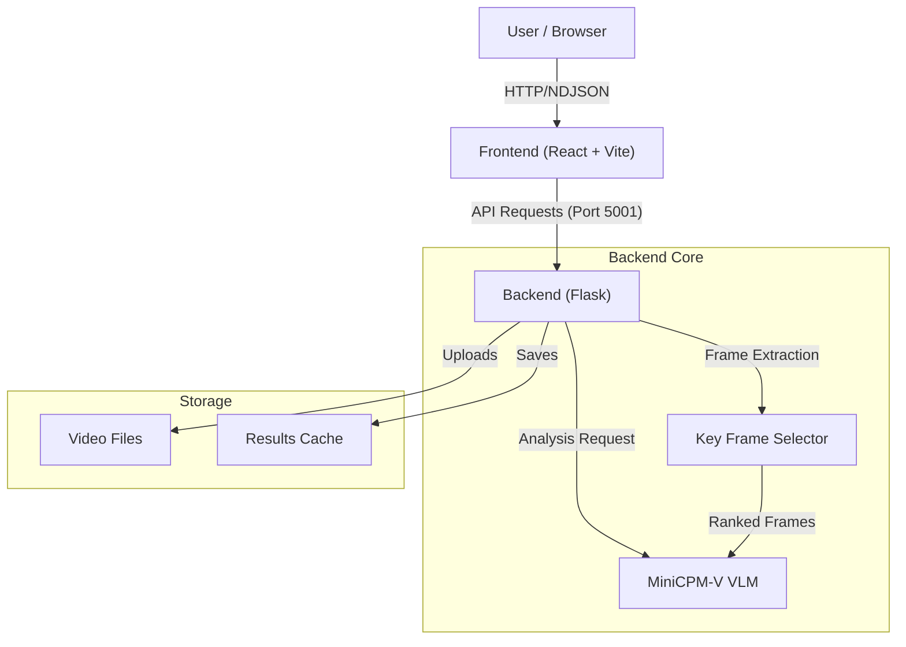

# AnyAnomaly

**AnyAnomaly** is an interactive, natural-language-driven Video Anomaly Detection (VAD) system. It leverages state-of-the-art Large Vision-Language Models (specifically [MiniCPM-V 2.6](https://huggingface.co/openbmb/MiniCPM-V-2_6)) to allow users to search for specific actions or anomalies in videos (e.g., "fighting", "running", "truck") simply by typing a prompt.

The system provides a visual timeline of events, Key Frame Selection (KFS), and explainable scoring, making complex video analysis accessible and intuitive.


## ✨ Features

- **Natural Language Detection**: Detect arbitrary anomalies using open-ended text prompts.
- **Multimodal Understanding**: built on MiniCPM-V 2.6 for strong OCR and action recognition.
- **Visual Storyline**: Extracts and displays keyframes relevant to your query.
- **Precise Timeline**: Interactive graph showing anomaly scores over time.
- **YouTube Support**: Analyze videos directly from YouTube URLs.
- **Edge Optimized**: Configurable for running on consumer hardware (Mac M-series, consumer GPUs) via int4 quantization.

## 🏗️ Architecture



## 🛠️ Tech Stack

- **Backend**: Python, Flask, PyTorch, Transformers, CLIP, OpenCV.
- **Frontend**: React, Vite, Tailwind CSS v4, Recharts.
- **AI Core**: MiniCPM-V 2.6 (AutoGPTQ/BitsAndBytes support planned).

## 🚀 Prerequisites

- **Python 3.10+**
- **Node.js 18+**
- **uv** (recommended for Python package management)
- **Hugging Face Account**: You need an Access Token with permission to access gated models (like MiniCPM-V).
- **FFmpeg**: Required for video processing (usually installed via system package manager).

## 📦 Installation

### 1. Clone the Repository
```bash
git clone https://github.com/yourusername/AnyAnomaly.git
cd AnyAnomaly
```

### 2. Backend Setup
We use `uv` for fast and reliable package management.

```bash
cd backend

# Create virtual environment
uv venv

# Activate virtual environment
source .venv/bin/activate

# Install dependencies
uv pip install -r requirements.txt
```

> **Note**: If you are on an Apple Silicon Mac, ensure you are using a Python version compatible with MPS (Metal Performance Shaders) for GPU acceleration.

### 3. Frontend Setup

```bash
cd ../frontend

# Install dependencies
npm install
```

## 🏃‍♂️ Usage

### Start the Backend (Windows)
We recommend using the provided PowerShell script for reliable startup:

```powershell
# In the root directory
.\start_backend.ps1
```

You can customize the startup behavior by editing the script or setting environment variables before running:

```powershell
$env:MODEL_PRECISION = "int4" # Switch to 4-bit quantized model
.\start_backend.ps1
```

### Start the Backend (Linux/Mac)
The backend runs on port `5001`.

```bash
# In backend/ directory
source .venv/bin/activate
export HF_TOKEN="your_hugging_face_token"
export MODEL_PRECISION="bf16" # or "int4"
python app.py
```

*The first run will download the MiniCPM-V model (~15.5GB for BF16, ~8GB for INT4). Ensure you have a stable internet connection.*

### Start the Frontend
The frontend runs on `http://localhost:5173`.

```bash
# In frontend/ directory
npm run dev
```

### Analyze a Video
1. Open `http://localhost:5173` in your browser.
2. Upload a local video file OR paste a YouTube URL.
3. Enter a text prompt (e.g., "person falling", "fire", "car crash").
4. Click **Analyze**.
5. View the score timeline and extracted keyframes.

## 🔧 Configuration

You can customize the backend behavior via environment variables:

- **`MODEL_PRECISION`**: Controls the model loading precision.
    - `bf16` (Default): Uses full-precision (BFloat16) model. Requires ~16GB VRAM/RAM.
    - `int4`: Uses 4-bit quantized model. Faster, requires ~8GB VRAM/RAM.
- **`INFERENCE_DEVICE`**: Manually set the inference device.
    - `auto` (Default): Automatically detects CUDA > MPS > CPU.
    - `cuda`, `mps`, `cpu`: Force usage of a specific device.
- **`HF_HOME`**: Directory to store Hugging Face model cache (e.g., `D:\huggingface`).
- **`UV_CACHE_DIR`**: Directory for `uv` package cache.
- **`FRAME_INTERVAL`**: (Upcoming) Process every Nth frame to speed up analysis.

## ⚠️ Troubleshooting

- **Port 5000 in use**: We use port 5001 by default because MacOS AirPlay Receiver claims port 5000.
- **403 Forbidden (Hugging Face)**: Ensure you have accepted the terms for `openbmb/MiniCPM-V-2_6` on the Hugging Face website and exported your `HF_TOKEN`.
- **MPS Out of Memory**: If running on a Mac with <32GB RAM, try closing other applications or wait for the int4 quantization update.

## 📜 License

MIT License. See `LICENSE` for details.
